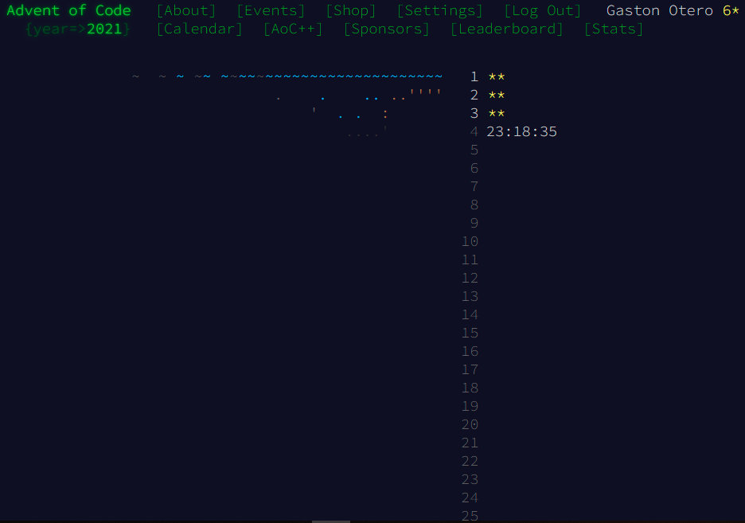

 # Advent of Code 2021 - Python

Here I'll be uploading my solutions to the challenges, in python.

You can find the instructions for each challenge here: [Advent of Code - 2021](https://adventofcode.com/2021)

Most of this solutions are meant to be made as fast as possible! So of course some of them won't be as pretty as I would like them to be.

## Current status

